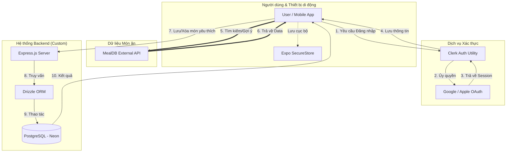

# 🍳 Ứng dụng Tìm kiếm Công thức Nấu ăn - Fullstack Documentation

Chào mừng bạn đến với tài liệu kỹ thuật của dự án **Recipe Finder**. Đây là một ứng dụng di động Fullstack hiện đại, được thiết kế để cung cấp trải nghiệm tìm kiếm và quản lý công thức nấu ăn mượt mà và bảo mật.

---

## 🏗️ Kiến trúc Hệ thống & Luồng chạy

Dưới đây là sơ đồ minh họa cách các thành phần trong hệ thống tương tác với nhau:



### Chi tiết các luồng chính:
1.  **Luồng Xác thực (Authentication)**: 
    - Ứng dụng sử dụng **Clerk** để quản lý danh tính. Khi người dùng đăng nhập bằng Social (Google/Apple), Clerk sẽ xử lý việc trao đổi token và trả về thông tin người dùng.
    - Một phần mở rộng đặc biệt là **Account Switcher**: Thông tin người dùng được lưu vào thiết bị thông qua `Expo SecureStore` để cho phép đăng nhập lại nhanh chóng.
2.  **Luồng Dữ liệu Công thức**: 
    - Các món ăn và thông tin chi tiết được lấy trực tiếp từ **TheMealDB API** để đảm bảo dữ liệu luôn phong phú và đa dạng.
3.  **Luồng Đồng bộ (Favorites Sync)**:
    - Khi người dùng nhấn "Yêu thích", ứng dụng sẽ gửi yêu cầu tới **Backend Node.js** tự xây dựng. Backend dùng **Drizzle ORM** để lưu trữ thông tin món ăn vào cơ sở dữ liệu **PostgreSQL**. Điều này giúp người dùng có thể đồng bộ danh sách yêu thích trên bất kỳ thiết bị nào sau khi đăng nhập.

---

## 🛠️ Vai trò của các Framework & Thư viện

### 1. Frontend (Thư mục `/mobile`)
- **Expo & React Native**: Nền tảng chính để xây dựng ứng dụng di động đa nền tảng (iOS/Android) với hiệu năng gần như thuần bản địa.
- **Expo Router**: Quản lý điều hướng dựa trên cấu trúc file (File-based routing), giúp tổ chức các màn hình `(auth)` và `(tabs)` một cách khoa học.
- **Clerk Expo**: Giải pháp bảo mật hàng đầu cho việc xác thực, hỗ trợ các chiến dịch Social Login và quản lý session cực kỳ đơn giản.
- **Expo SecureStore**: Dùng để lưu trữ thông tin nhạy cảm của người dùng một cách an toàn trên bộ nhớ thiết bị (dùng cho tính năng Account Switcher).

### 2. Backend (Thư mục `/backend`)
- **Express.js**: Một framework web tối giản cho Node.js, chịu trách nhiệm xây dựng các API Endpoint để xử lý danh sách yêu thích của người dùng.
- **Drizzle ORM**: Một ORM (Object-Relational Mapping) thế hệ mới, cực kỳ nhẹ và có tính năng **Type-safe** hoàn hảo. Nó giúp việc viết các câu lệnh SQL vào Database trở nên an toàn và dễ dàng bảo trì hơn.
- **PostgreSQL (Neon)**: Cơ sở dữ liệu quan hệ mạnh mẽ, lưu trữ bền vững thông tin yêu thích của người dùng.

---

## ⚙️ Cài đặt & Cấu hình môi trường

Dự án yêu cầu các biến môi trường để hoạt động:

### Mobile (`/mobile/.env`):
```env
EXPO_PUBLIC_CLERK_PUBLISHABLE_KEY=pk_test_...
```

### Backend (`/backend/.env`):
```env
DATABASE_URL=postgres://...
PORT=5001
```

---

## 🚀 Hướng dẫn khởi động nhanh

1.  **Backend**:
    ```bash
    cd backend
    npm install
    npm start
    ```
2.  **Mobile**:
    ```bash
    cd mobile
    npm install
    npx expo start
    ```

---
*Tài liệu này được tạo ra để giúp đội ngũ phát triển và người dùng nắm bắt nhanh chóng cấu trúc kỹ thuật của Recipe Finder.* 🍳
